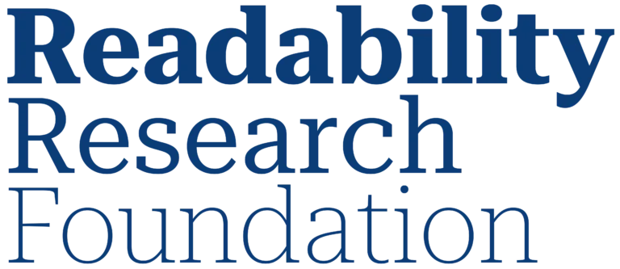

  

**Advancing the science of reading, readability, and digital text.**

*Please pardon our dust — a new site is coming soon.*

## What do we want to do?

Someone you love has problems with reading, and so you know how very little is understood about why and how to help.

The Readability Research Foundation funds the researchers who will help, fueling discoveries that improve reading outcomes for everyone.

Our community’s research helps Fortune 50 companies deliver text to billions of readers every day, is changing how educators help entire classrooms learn to read, and powers AI that democratizes typography.

## Who are we?

### Dr. Benjamin Wolfe
Assistant Professor, Psychological & Brain Sciences  
University of Toronto Mississauga

---

### Dr. Ben D. Sawyer
Associate Professor, Industrial Engineering  
University of Central Florida

---

### Dr. Shaun Wallace
Assistant Professor, Computer Science  
University of Rhode Island

**More researchers and community members will be joining soon.**
